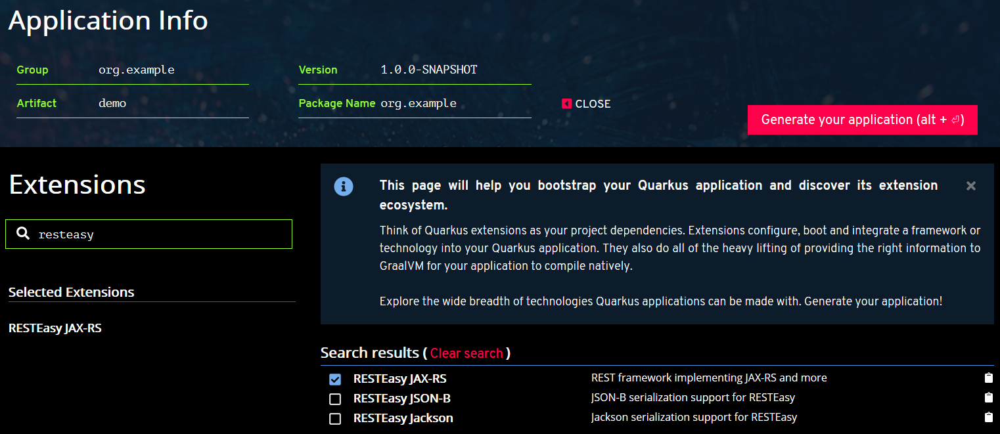

# Kickstart your first Quarkus application

[TOC]

[Quarkus](https://quarkus.io) is a container-first framework for building Docker/K8s  ready  applications.

##  Getting Started

First of all, make you have the following software installed.

* JDK 8 +
* Apache Maven 3.5+
*  [GraalVM](https://www.graalvm.org)  to build native image
* Docker

Go to https://code.quarkus.io , and generate a project skeleton.

* Group: com.example
* Artifact: demo
* Extensions: RESTEasy JAX-RS



Extract files from the download archive,  and import into your favorite IDE.

Follow the [Getting Started](https://quarkus.io/get-started/) guide,  create your first JAX-RS Resource class.

```java
@Path("/hello")
public class GreetingResource {

    @Inject
    GreetingService service;

    @GET
    @Produces(MediaType.TEXT_PLAIN)
    @Path("/greeting/{name}")
    public String greeting(@PathParam("name") String name) {
        return service.greet(name);
    }

    @GET
    @Produces(MediaType.TEXT_PLAIN)
    public String hello() {
        return "hello";
    }
}
```

The `GreetingService` is a CDI managed bean. We declare it as `ApplicationScoped` scope, and make it available in the application globally. 

```class
import javax.enterprise.context.ApplicationScoped;

@ApplicationScoped
public class GreetingService {
    public String greet(String name) {
        return "Hello " + name+"!";
    }
}
```

> Quarkus does not require a JAX-RS `Application`  to activate JAX-RS support.  

Run the following command to build the application. 

```bash
mvn clean package
```

After it is done, there are two jars in the target folder.  `xxx-runner.jar`  is a runnable jar created by *quarkus-maven-plugin*.

```bash
>java -jar target\demo-1.0.0-SNAPSHOT-runner.jar
```

In development stage, you can run the application in development mode.

```bash
mvn compile quarkus:dev
```
You will see the following info. 

```
[INFO] --- quarkus-maven-plugin:0.21.1:dev (default-cli) @ demo ---
Listening for transport dt_socket at address: 5005
2019-09-06 11:39:08,764 INFO  [io.qua.dep.QuarkusAugmentor] (main) Beginning quarkus augmentation
2019-09-06 11:39:09,560 INFO  [io.qua.dep.QuarkusAugmentor] (main) Quarkus augmentation completed in 796ms
2019-09-06 11:39:10,072 INFO  [io.quarkus] (main) Quarkus 0.21.1 started in 1.464s. Listening on: http://[::]:8080
2019-09-06 11:39:10,072 INFO  [io.quarkus] (main) Installed features: [cdi, resteasy]
```
Test the hello endpoint with  `curl`.

```bash
>curl http://localhost:8080/hello
hello
```

Quarkus provides test facilities with JUnit 5 and RestAssured.  There are two dependencies already added in the *pom.xml*.

```xml
<dependency>
    <groupId>io.quarkus</groupId>
    <artifactId>quarkus-junit5</artifactId>
    <scope>test</scope>
</dependency>
<dependency>
    <groupId>io.rest-assured</groupId>
    <artifactId>rest-assured</artifactId>
    <scope>test</scope>
</dependency>
```

Create a test case for the  `GreetingResourceTest`. 

```java
@QuarkusTest
public class GreetingResourceTest {

    @Test
    public void testHelloEndpoint() {
        given()
          .when().get("/hello")
          .then()
             .statusCode(200)
             .body(is("hello"));
    }

    @Test
    public void testGreetingEndpoint() {
        String uuid = UUID.randomUUID().toString();
        given()
                .pathParam("name", uuid)
                .when().get("/hello/greeting/{name}")
                .then()
                .statusCode(200)
                .body(is("Hello " + uuid + "!"));
    }

}
```

 `QuarkusTest` is  composed with JUnit 5 `@ExtendedWith`.

```java
@ExtendWith(QuarkusTestExtension.class)
@Retention(RetentionPolicy.RUNTIME)
@Target(ElementType.TYPE)
public @interface QuarkusTest {
}
```

You can customize your own annotation with `@QuarkusTest` like this.

```java
@Transactional
@Stereotype
@QuarkusTest
public @interface TransactionalQuarkusTest{}
```

OK ,  let's create RESTful APIs for a blog application that I have used in several samples on [Github](https://github.com/hantsy).

## Building RESTful APIs


Let's assume this simple blog system should satisfy  the following requirements:

* A user can view all posts
* A user can post an new blog entry
* A user can view all comments on the posts 
* A user can write comments on the posts 
*  An admin role can moderate the post and delete the post
*  ...

Currently we skip the security issues.  We will discuss it in the further posts.

Following the REST convention and HTTP protocol specification, the RESTful  APIs  are designed as the following table.

| Uri                  | Request                                                      | Response                                        | Description                              |
| -------------------- | ------------------------------------------------------------ | ----------------------------------------------- | ---------------------------------------- |
| /posts               | GET                                                          | 200, [{'id':1, 'title'},{}]                     | Get all posts                            |
| /posts               | POST         {'id':1, 'title':'test title','content':'test content'} | 201                                             | Create a new post                        |
| /posts/{id}          | GET                                                          | 200, {'id':1, 'title'}                          | Get a post by id                         |
| /posts/{id}          | PUT          {'title':'test title','content':'test content'} | 204                                             | Update a post                            |
| /posts/{id}          | DELETE                                                       | 204                                             | Delete a post by id                      |
| /posts/{id}/comments | GET                                                          | 200, [{'id':1, 'content':'comment content'},{}] | Get all comments of the certain post     |
| /posts/{id}/comments | POST        {'content':'test content'}                       | 201                                             | Create a new comment of the certain post |

Create a POJO class for representing Post entity.

```java
public class Post implements Serializable {

    String id;
    String title;
    String content;
    LocalDateTime createdAt;

    public static Post of(String title, String content) {
        Post post = new Post();
        post.setId(UUID.randomUUID().toString());
        post.setCreatedAt(LocalDateTime.now());
        post.setTitle(title);
        post.setContent(content);

        return post;
    }
    //getters and setters
 }   
```

The `of` is factory method to create a new Post quickly.

Create a `PostRepository`  to retrieve data from and save to the "database". We used a dummy map here, will replace it with a real database later.

```java
@ApplicationScoped
public class PostRepository {

    static Map<String, Post> data = new ConcurrentHashMap<>();

    public List<Post> all() {
        return new ArrayList<>(data.values());
    }

    public Post getById(String id) {
        return data.get(id);
    }

    public Post save(Post post) {
        data.put(post.getId(), post);
        return post;
    }

    public void deleteById(String id) {
        data.remove(id);
    }
}
```

Now  create a `PostResource` to expose the posts endpoints to public. 

```java
@Path("/posts")
@RequestScoped
public class PostResource {
    private final static Logger LOGGER = Logger.getLogger(PostResource.class.getName());

    private final PostRepository posts;

    @Context
    ResourceContext resourceContext;

    @Context
    UriInfo uriInfo;

    @Inject
    public PostResource(PostRepository posts) {
        this.posts = posts;
    }

    @GET
    @Produces(MediaType.APPLICATION_JSON)
    public Response getAllPosts() {
        return ok(this.posts.all()).build();
    }

    @POST
    @Consumes(MediaType.APPLICATION_JSON)
    public Response savePost(@Valid Post post) {
        Post saved = this.posts.save(Post.of(post.getTitle(), post.getContent()));
        return created(
            uriInfo.getBaseUriBuilder()
                .path("/posts/{id}")
                .build(saved.getId())
        ).build();
    }

    @Path("{id}")
    @GET
    @Produces(MediaType.APPLICATION_JSON)
    public Response getPostById(@PathParam("id") final String id) {
        Post post = this.posts.getById(id);
        return ok(post).build();
    }

    @Path("{id}")
    @PUT
    @Consumes(MediaType.APPLICATION_JSON)
    public Response updatePost(@PathParam("id") final String id, @Valid Post post) {
        Post existed = this.posts.getById(id);
        existed.setTitle(post.getTitle());
        existed.setContent(post.getContent());

        Post saved = this.posts.save(existed);
        return noContent().build();
    }


    @Path("{id}")
    @DELETE
    public Response deletePost(@PathParam("id") final String id) {
        this.posts.deleteById(id);
        return noContent().build();
    }
}
```

Almost done, let's initialize some data for test purpose. `Quarkus` provides lifecycle events that you can observes in a CDI bean.

```java
@ApplicationScoped
public class AppInitializer {
    private final static Logger LOGGER = Logger.getLogger(AppInitializer.class.getName());

    @Inject
    private PostRepository posts;

    void onStart(@Observes StartupEvent ev) {
        LOGGER.info("The application is starting...");
        Post first = Post.of("Hello Quarkus", "My first post of Quarkus");
        Post second = Post.of("Hello Again, Quarkus", "My second post of Quarkus");

        this.posts.save(first);
        this.posts.save(second);
    }

    void onStop(@Observes ShutdownEvent ev) {
        LOGGER.info("The application is stopping...");
    }
}
```

Let's start the application via:

```bash
mvn quarkus:dev
```
And when we try to access the APIs by `curl`.

```bash
$ curl http://localhost:8080/posts
Could not find MessageBodyWriter for response object of type: java.util.ArrayList of media type: application/json
```
An errer is occurred, `media type: application/json` can not be handled.

In the former steps,  we have just created a `GreetingResource`, `plain/text` media type is  used for test purpose. In a real world application, JSON is  the most popular representation format. 

To fix the issue, we should add JSON support for the representation marshalling and unmarshalling. 

*quarkus-maven-plugin*  provides several goals for managing the extensions in the project.

*list-extensions* will print all available extensions in the Quarkus ecosystem.

```bash
> mvn quarkus:list-extensions
...
Current Quarkus extensions available: 
Agroal - Database connection pool                  quarkus-agroal                                    
Amazon DynamoDB                                    quarkus-amazon-dynamodb                           
Apache Kafka Client                                quarkus-kafka-client                              
Apache Kafka Streams                               quarkus-kafka-streams                             
Apache Tika                                        quarkus-tika                                      
Arc                                                quarkus-arc                                       
AWS Lambda                                         quarkus-amazon-lambda                             
Flyway                                             quarkus-flyway                                    
Hibernate ORM                                      quarkus-hibernate-orm                             
Hibernate ORM with Panache                         quarkus-hibernate-orm-panache                     
Hibernate Search + Elasticsearch                   quarkus-hibernate-search-elasticsearch            
Hibernate Validator                                quarkus-hibernate-validator                       
Infinispan Client                                  quarkus-infinispan-client                         
JDBC Driver - H2                                   quarkus-jdbc-h2                                   
JDBC Driver - MariaDB                              quarkus-jdbc-mariadb                              
JDBC Driver - PostgreSQL                           quarkus-jdbc-postgresql                           
Jackson                                            quarkus-jackson                                   
JSON-B                                             quarkus-jsonb                                     
JSON-P                                             quarkus-jsonp                                     
Keycloak                                           quarkus-keycloak                                  
Kogito                                             quarkus-kogito                                    
Kotlin                                             quarkus-kotlin                                    
Kubernetes                                         quarkus-kubernetes                                
Kubernetes Client                                  quarkus-kubernetes-client                         
Mailer                                             quarkus-mailer                                    
MongoDB Client                                     quarkus-mongodb-client                            
Narayana JTA - Transaction manager                 quarkus-narayana-jta                              
Neo4j client                                       quarkus-neo4j                                     
Reactive PostgreSQL Client                         quarkus-reactive-pg-client                        
RESTEasy                                           quarkus-resteasy                                  
RESTEasy - JSON-B                                  quarkus-resteasy-jsonb                            
RESTEasy - Jackson                                 quarkus-resteasy-jackson                          
Scheduler                                          quarkus-scheduler                                 
Security                                           quarkus-elytron-security                          
Security OAuth2                                    quarkus-elytron-security-oauth2                   
SmallRye Context Propagation                       quarkus-smallrye-context-propagation              
SmallRye Fault Tolerance                           quarkus-smallrye-fault-tolerance                  
SmallRye Health                                    quarkus-smallrye-health                           
SmallRye JWT                                       quarkus-smallrye-jwt                              
SmallRye Metrics                                   quarkus-smallrye-metrics                          
SmallRye OpenAPI                                   quarkus-smallrye-openapi                          
SmallRye OpenTracing                               quarkus-smallrye-opentracing                      
SmallRye Reactive Streams Operators                quarkus-smallrye-reactive-streams-operators       
SmallRye Reactive Type Converters                  quarkus-smallrye-reactive-type-converters         
SmallRye Reactive Messaging                        quarkus-smallrye-reactive-messaging               
SmallRye Reactive Messaging - Kafka Connector      quarkus-smallrye-reactive-messaging-kafka         
SmallRye Reactive Messaging - AMQP Connector       quarkus-smallrye-reactive-messaging-amqp          
REST Client                                        quarkus-rest-client                               
Spring DI compatibility layer                      quarkus-spring-di                                 
Spring Web compatibility layer                     quarkus-spring-web                                
Swagger UI                                         quarkus-swagger-ui                                
Undertow                                           quarkus-undertow                                  
Undertow WebSockets                                quarkus-undertow-websockets                       
Eclipse Vert.x                                     quarkus-vertx                                     

```

Add **RESTEasy - JSON-B** to this project.

```bash
>mvn quarkus:add-extension -Dextension=resteasy-jsonb
...
[INFO] --- quarkus-maven-plugin:0.21.1:add-extension (default-cli) @ demo ---
? Adding extension io.quarkus:quarkus-resteasy-jsonb
```

> Both quarkus-resteasy-jsonb and quarkus-resteasy-jackson work.  We use quarkus-resteasy-jsonb here.

Open the pom.xml file,  there  is a new dependency added.  Of course, you can add this extension in Maven dependencies directly.

```xml
<dependency>
    <groupId>io.quarkus</groupId>
    <artifactId>quarkus-resteasy-jsonb</artifactId>
</dependency>
```

Restart the application and try again.

```bash
> curl http://localhost:8080/posts
[{"content":"My second post of Quarkus","createdAt":"2019-09-06T16:48:03.0799469","id":"8059eb1d-5d26-4eb3-b9df-39151a5f71f5","title":"Hello Again, Quarkus"},{"content":"My first post of Quarkus","createdAt":"2019-09-06T16:48:03.0799469","id":"96974c19-cdca-4d34-a589-68728cf1e2ed","title":"Hello Quarkus"}]

```

Now  let's move to  Comment resource. 

Create a POJO for Comment.

```java
public class Comment implements Serializable {
    private String id;
    private String post;
    private String content;
    private LocalDateTime createdAt;

    public static Comment of(String postId, String content) {
        Comment comment = new Comment();

        comment.setId(UUID.randomUUID().toString());
        comment.setContent(content);
        comment.setCreatedAt(LocalDateTime.now());
        comment.setPost(postId);

        return comment;
    }
    //getters and setters
    
}
```

Create a dummy  `CommentRepository` for Comment.

```java
@ApplicationScoped
public class CommentRepository {
    static Map<String, Comment> data = new ConcurrentHashMap<>();

    public List<Comment> all() {
        return new ArrayList<>(data.values());
    }

    public Comment getById(String id) {
        return data.get(id);
    }

    public Comment save(Comment comment) {
        data.put(comment.getId(), comment);
        return comment;
    }

    public void deleteById(String id) {
        data.remove(id);
    }

    public List<Comment> allByPostId(String id) {
        return data.values().stream().filter(c -> c.getPost().equals(id)).collect(toList());
    }
}

```

Create a `CommentResource`  class to expose comments endpoints.

```java
@Unremovable
@RegisterForReflect
@RequestScoped
public class CommentResource {
    private final static Logger LOGGER = Logger.getLogger(CommentResource.class.getName());
    private final CommentRepository comments;

    @Context
    UriInfo uriInfo;

    @Context
    ResourceContext resourceContext;

    @PathParam("id")
    String postId;

    @Inject
    public CommentResource(CommentRepository commentRepository) {
        this.comments = commentRepository;
    }

    @GET
    public Response getAllComments() {
        return ok(this.comments.allByPostId(this.postId)).build();
    }

    @POST
    public Response saveComment(Comment commentForm) {
        Comment saved = this.comments.save(Comment.of(this.postId, commentForm.getContent()));
        return created(
                uriInfo.getBaseUriBuilder()
                        .path("/posts/{id}/comments/{commentId}")
                        .build(this.postId, saved.getId())
        ).build();
    }
}

```


> Currently we have to add @Unremovable on CommentResource to make it work in Quarkus, see  [question on stackoverflow](https://stackoverflow.com/questions/57820428/jax-rs-subresource-issue-in-quarkus]) and  [Quarkus issue#3919](https://github.com/quarkusio/quarkus/issues/3919).

Maybe you have noticed we have not added a `@Path` on this class. Comment can be designed as a sub resources of  `PostResource`.  JAXRS has a good mechanism to register a sub resource in the parent.

Add the following method in the `PostResource` we have created.

```java
public class PostResource{
    //other methods are omitted here.
    
   @Path("{id}/comments")
    public CommentResource commentResource() {
        return resourceContext.getResource(CommentResource.class);
    }    
}   
```

Let's try to add some comments.

```bash
$ curl -v -X POST  http://localhost:8080/posts/e1ddbe3d-2964-4b1e-8aa8-1d3be8e30c3c/comments  -H "Content-Type:application/json" -H "Accept:application/json" -d "{\"content\":\"test comment\"}"

> POST /posts/e1ddbe3d-2964-4b1e-8aa8-1d3be8e30c3c/comments HTTP/1.1
> Host: localhost:8080
> User-Agent: curl/7.65.0
> Content-Type:application/json
> Accept:application/json
> Content-Length: 26
>
< HTTP/1.1 201 Created
< Connection: keep-alive
< Location: http://localhost:8080/posts/e1ddbe3d-2964-4b1e-8aa8-1d3be8e30c3c/comments/a4c14681-cc5e-42b6-aba2-02a83263cd95
< Content-Length: 0
< Date: Sat, 07 Sep 2019 07:31:28 GMT
<
```

It is created successfully, and return a 201 status code. The location header in the response is the newly added comment. 

Check  if the comment is existed.

```bash
 >curl http://localhost:8080/posts/e1ddbe3d-2964-4b1e-8aa8-1d3be8e30c3c/comments -H "Accept:application/json"
[{"content":"test comment","createdAt":"2019-09-07T15:31:28.306218","id":"a4c14681-cc5e-42b6-aba2-02a83263cd95","post":"e1ddbe3d-2964-4b1e-8aa8-1d3be8e30c3c"}]
```

## Exception Handling and Bean Validation 

JAX-RS provides exception handling for APIs.

Chang  `getPostById` method of `PostResource` to the following.  

```java
public Response getPostById(@PathParam("id") final String id) {
    Post post = this.posts.getById(id);
    if (post == null) {
        throw new PostNotFoundException(id);
    }
    return ok(post).build();
}
```

If the post is not found, throw a `PostNotFoundException`.

```java
public class PostNotFoundException extends RuntimeException {
    public PostNotFoundException(String id) {
        super("Post:" + id + " was not found!");
    }
}
```

Create an `ExceptionMapper` to handle it.

```java
@Provider
public class PostNotFoundExceptionMapper implements ExceptionMapper<PostNotFoundException> {
    @Override
    public Response toResponse(PostNotFoundException exception) {
        return status(Response.Status.NOT_FOUND).entity(exception.getMessage()).build();
    }
}
```
Verify if it  works as expected.

```bash
> curl -v http://localhost:8080/posts/nonexisted

> GET /posts/nonexisted HTTP/1.1
> Host: localhost:8080
> User-Agent: curl/7.55.1
> Accept: */*
>
> < HTTP/1.1 404 Not Found
> < Connection: keep-alive
> < Content-Type: application/json
> < Content-Length: 30
> < Date: Fri, 06 Sep 2019 09:58:28 GMT
> <
> Post:nonexisted was not found!
```

Like the  Bean Validation support in Java EE/JAX-RS, Quarkus also provides seamless Bean Validation support via Hibernate Validator.

Add *hibernate-validator*  extension to  this project. 

```bash
> mvn quarkus:add-extension -Dextension=hibernate-validator
```

It will add `quarkus-hibernate-validator` into dependencies.

```xml
<dependency>
    <groupId>io.quarkus</groupId>
    <artifactId>quarkus-hibernate-validator</artifactId>
</dependency>
```

For example, when a user comments on a post, the comment content should not be empty.

Create a POJO class for representing the Comment form data. 

```java
public class CommentForm implements Serializable {

    @NotEmpty
    private String content;

    public static CommentForm of(String content) {
        CommentForm form= new CommentForm();
        form.setContent(content);
        return form;
    }

   //getters and setters
}

```

Change the `saveComment` method of `CommentResource` like this.

```java
 public Response saveComment(@Valid CommentForm commentForm) {...}
```

`@Valid` indicates the request body should be validated by Bean validation framework when this method is invoked. If the validation is failed,  a `ConstraintViolationException` will be thrown.

Create a `ExceptionMapper` to handle this exception.

```java
@Provider
public class BeanValidationExceptionMapper implements ExceptionMapper<ConstraintViolationException> {
    @Override
    public Response toResponse(ConstraintViolationException exception) {
        Map<String, String> errors = new HashMap<>();
        exception.getConstraintViolations()
                .forEach(v -> {
                    errors.put(lastFieldName(v.getPropertyPath().iterator()), v.getMessage());
                });
        return status(Response.Status.BAD_REQUEST).entity(errors).build();
    }

    private String lastFieldName(Iterator<Path.Node> nodes) {
        Path.Node last = null;
        while (nodes.hasNext()) {
            last = nodes.next();
        }
        return last.getName();
    }
}
```

Verify if it works. 

```bash
>$ curl -v -X POST  http://localhost:8080/posts/e1ddbe3d-2964-4b1e-8aa8-1d3be8e30c3c/comments  -H "Content-Type:application/json" -H "Accept:application/json" -d "{\"content\":\"\"}"

> POST /posts/e1ddbe3d-2964-4b1e-8aa8-1d3be8e30c3c/comments HTTP/1.1
> Host: localhost:8080
> User-Agent: curl/7.65.0
> Content-Type:application/json
> Accept:application/json
> Content-Length: 14
>

< HTTP/1.1 400 Bad Request
< Connection: keep-alive
< Content-Type: application/json
< Content-Length: 31
< Date: Sat, 07 Sep 2019 03:20:37 GMT
<
...
{"content":"must not be empty"}

```

## Visualizing APIs with MP OpenAPI and SwaggerUI

The  original Swagger schema was standardized as OpenAPI, and Microprofile brings it into Java EE by [Microprofile OpenAPI Spec](https://github.com/eclipse/microprofile-open-api/).

Quarkus provides an extension to support Microprofile OpenAPI.

Install `openapi` extension via `quarkus-maven-plugin`.

```bash
mvn quarkus:add-extension -Dextension=openapi
```

It will add `quarkus-smallrye-openapi` dependency into the *pom.xml* file.

```xml
<dependency>
    <groupId>io.quarkus</groupId>
    <artifactId>quarkus-smallrye-openapi</artifactId>
</dependency>
```

Start the application, and try to access http://localhost:8080/openapi.

```bash
> curl http://localhost:8080/openapi
---
openapi: 3.0.1
info:
  title: Generated API
  version: "1.0"
paths:
  /hello:
    get:
      responses:
        200:
          description: OK
          content:
            text/plain:
              schema:
                $ref: '#/components/schemas/String'
  /hello/async:
    get:
      responses:
        200:
          description: OK
          content:
            text/plain:
              schema:
                type: string
  /hello/greeting/{name}:
    get:
      parameters:
      - name: name
        in: path
        required: true
        schema:
          $ref: '#/components/schemas/String'
      responses:
        200:
          description: OK
          content:
            text/plain:
              schema:
                $ref: '#/components/schemas/String'
  /posts:
    get:
      responses:
        200:
          description: OK
          content:
            application/json: {}
    post:
      requestBody:
        content:
          application/json:
            schema:
              $ref: '#/components/schemas/Post'
      responses:
        200:
          description: OK
          content:
            '*/*': {}
  /posts/{id}:
    get:
      parameters:
      - name: id
        in: path
        required: true
        schema:
          $ref: '#/components/schemas/String'
      responses:
        200:
          description: OK
          content:
            application/json: {}
    put:
      parameters:
      - name: id
        in: path
        required: true
        schema:
          $ref: '#/components/schemas/String'
      requestBody:
        content:
          application/json:
            schema:
              $ref: '#/components/schemas/Post'
      responses:
        200:
          description: OK
          content:
            '*/*': {}
    delete:
      parameters:
      - name: id
        in: path
        required: true
        schema:
          $ref: '#/components/schemas/String'
      responses:
        200:
          description: OK
          content:
            '*/*': {}
components:
  schemas:
    String:
      type: string
    Post:
      type: object
      properties:
        content:
          type: string
        createdAt:
          format: date-time
          type: string
        id:
          type: string
        title:
          type: string

```

You can change the endpoint location if you dislike the default "/openapi", just add the following line in the *application.properties*.

```properties
quarkus.smallrye-openapi.path=/swagger
```

As you see,  in the generated schema, some description are not clear as expected, eg.  the **GET**  */posts* operation return type description is a little not friendly for API users. You can use Microprofile OpenAPI annotations to enrich it.

```java
@Operation(
    summary = "Get all Posts",
    description = "Get all posts"
)
@APIResponse(
    responseCode = "200",
    name = "Post list",
    content = @Content(
        mediaType = "application/json",
        schema = @Schema(
            type = SchemaType.ARRAY,
            implementation = Post.class
        )
    )
)
public Response getAllPosts() {...}
```

Start the application and access http://localhost:8080/openapi again. 

```bash
 /posts:
    get:
      summary: Get all Posts
      description: Get all posts
      responses:
        200:
          content:
            application/json:
              schema:
                type: array
                items:
                  $ref: '#/components/schemas/Post'
```

The Swagger UI is also available in development mode. Open a browser, and navigate to http://localhost:8080/swagger-ui.


If you want to change the default endpoint path of Swagger UI,  add  the following entry in the `application.properties`.

```properties
quarkus.swagger-ui.path=/my-custom-path
```

The Swagger UI is only enabled in dev mode, if you want it included in all environments, add the following configuration in the `application.proerpties`.

```properties
quarkus.swagger-ui.always-include=true
```

> Unfortunately, the CommentResource is not included in the generated OpenAPI schema, maybe it is an issues of subresource support in Microprofile OpenAPI spec,  see [Quarkus issue#3918](https://github.com/quarkusio/quarkus/issues/3918).

