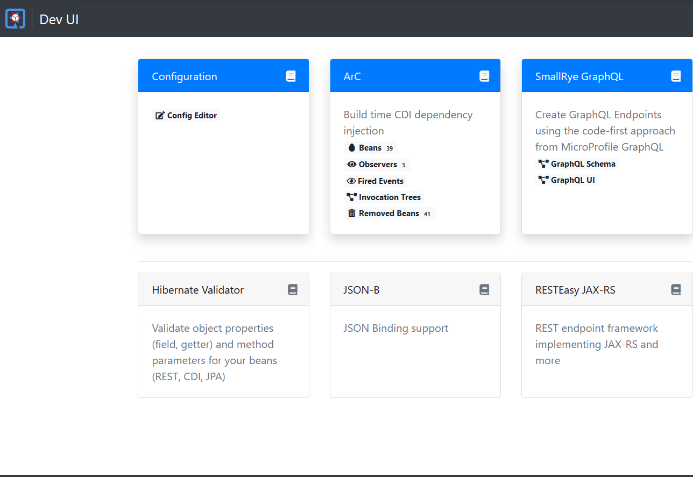
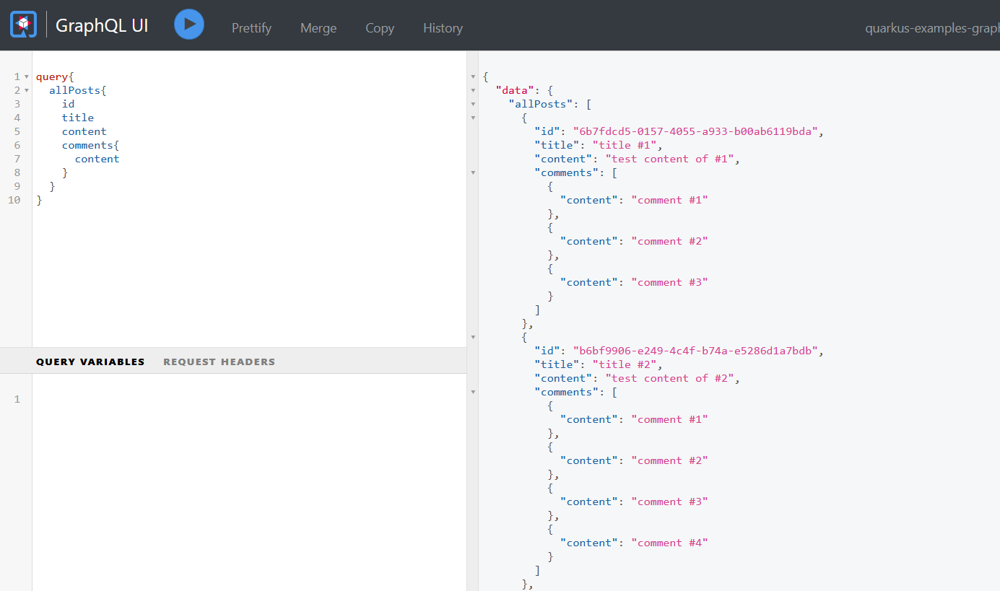
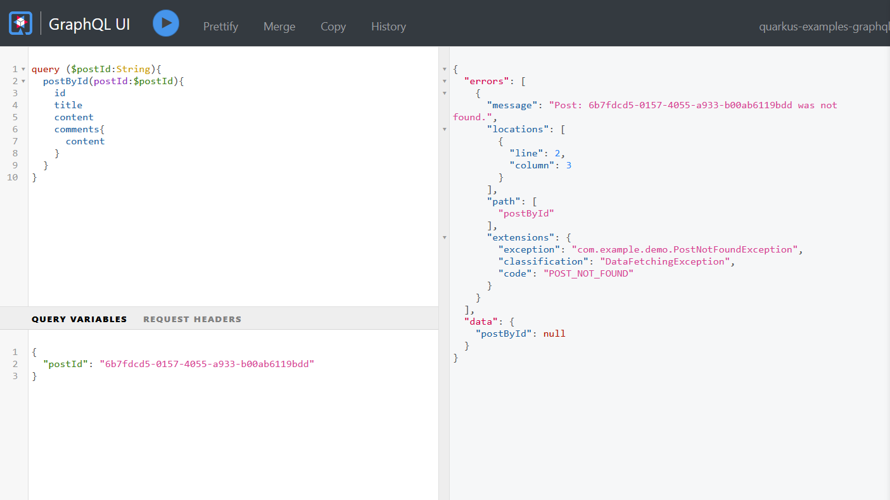

# Building GraphQL APIs with Quarkus

[GraphQL](https://graphql.org/) is used as an alternative of REST to build Web APIs and becomes more and more popular in these days.


## What is GraphQL?

The initial GraphQL protocol is created by Facebook, and now it is maintained by the GraphQL Foundation. From the home page of the official GraphQL website, GraphQL was described as:

>GraphQL is a query language for APIs and a runtime for fulfilling those queries with your existing data. GraphQL provides a complete and understandable description of the data in your API, gives clients the power to ask for exactly what they need and nothing more, makes it easier to evolve APIs over time, and enables powerful developer tools.

Go to the GraphQL [Code](https://graphql.org/code) page, it lists the current GraphQL tools and libraries implemented in different languages.

The latest Quarkus adds an extra MicroProfile GraphQL implementation (via SmallRye GraphQL) to replace the original Vertx implementation.

In this post, we will create a Quarkus project and experience this built-in GraphQL feature.


## Generating Project Skeleton

Open your browser,  navigate to [Quarkus Code](https://code.quarkus.io) page, add *SmallRye GraphQL* into the project dependencies, then hit the  *Generate your application* to generate the project skeleton. Download the generated archive and extract the files in your disc, and import the project into your IDE.

For the existing Quarkus project,  open a terminal and switch to the project root folder, and run the following command to add *SmallRye GraphQL* extension.

```bash
mvn quarkus:add-extension -Dextensions="smallrye-graphql"
```

Finally, you will find the following dependency is added in the *pom.xml* file.

```xml
<dependency>
    <groupId>io.quarkus</groupId>
    <artifactId>quarkus-smallrye-graphql</artifactId>
</dependency>
```

Next, let's cook the GraphQL API. 

Similar to building RESTful APIs, there are two principles to choose,  **code first** or **schema first**. 

SmallRye GraphQL follows the **code first** principle and generate the GraphQL schema from codes at runtime.


## Declaring GraphQL API

Create a class and add a `@GraphQLApi` annotation on the class to declare the GraphQL API.

```java
@GraphQLApi
@RequiredArgsConstructor
public class GraphQLResource {
    final PostService postService;

    @Query
    @Description("Get all posts")
    public List<Post> getAllPosts() {
        return this.postService.getAllPosts();
    }

    @Query
    @Description("Get a specific post by providing an id")
    public Optional<Post> getPostById(@Name("postId") String id) {
        return this.postService.getPostById(id);
    }

    @Mutation
    @Description("Create a new post")
    public Post createPost(@Valid CreatePost createPostInput) {
        return this.postService.createPost(createPostInput);
    }
}
```

In the above code snippets, `@RequiredArgsConstructor` is a [Lombok](https://projectlombok.org/) annotation(do not forget add `org.projectlombok:lombok` into your dependencies). 

The `PostService` is a CDI bean to handle the certain business logic.

The `@Query` defines a `query` operation, `Post` is mapped to a GraphQL *ObjectType*,  `@Name("postId")` defines the name of a GraphQL *Argument*,  and `@Mutation` is a `mutation` operation, `CreatePost` is mapped to a GraphQL *Input* type.

More about the concept of GraphQL, such as *Query*, *Mutation*, *Object Type*, and *Input Type*, please refer to the [GraphQL Learn page](https://graphql.org/learn/).

Let's have a  look at the content of `Post`, `Comment`, and `CreatePost`.

```java
@Data
@Builder
@ToString
@Type
@NoArgsConstructor
@AllArgsConstructor
public class Post {
    @Id
    String id;
    String title;
    String content;

    int countOfComments;

    @Builder.Default
    List<Comment> comments = new ArrayList<>();
}

@Data
@Builder
@Type
@NoArgsConstructor
@AllArgsConstructor
public class Comment {
    @Id
    String id;
    String content;
}


@Data
@Builder
@NoArgsConstructor
@AllArgsConstructor
@Input
public class CreatePost {
    String title;

    String content;
}
```

Note there are two annotations:  `@Type` and `@Input` are added on the classes. Other annotations are from Lombok.

Let's move on to the `PostService` class.

```java
@ApplicationScoped
public class PostService {

    static List<Post> STORE = new ArrayList<>();

    public void init(List<Post> data) {
        STORE.clear();
        STORE.addAll(data);
    }

    List<Post> getAllPosts() {
        return STORE;
    }

    Optional<Post> getPostById(String id) {
        return STORE.stream().filter(p -> p.id.equals(id)).findFirst();
    }

    Post createPost(CreatePost postInput) {
        var data = Post.builder().id(UUID.randomUUID().toString())
                .title(postInput.title)
                .content(postInput.content)
                .build();
        STORE.add(data);
        return data;
    }
}
```

 It is a dummy implementation to erase the backend database requirements. You can simply replace it with the codes accessing the real database.

## Running Application

Before running the application, let's add some sample data.  Create a CDI bean to observe the `StartupEvent` event, it will  be executed when the application is already started.

```java
@ApplicationScoped
@RequiredArgsConstructor
public class DataInitializer {
    public static final Logger LOGGER = Logger.getLogger(DataInitializer.class.getName());
    //
    final PostService postService;

    //
    public void onStartup(@Observes StartupEvent e) {

        var initData = IntStream.range(1, 5).mapToObj(
                i -> {
                    var comments = IntStream.range(1, new Random().nextInt(5)+1).mapToObj(c -> Comment.builder().id(UUID.randomUUID().toString()).content("comment #" + c).build())
                            .toList();
                    var data = Post.builder().title("title #" + i)
                            .id(UUID.randomUUID().toString())
                            .content("test content of #" + i)
                            .comments(comments)
                            .build();
                    return data;
                }
        ).toList();

        this.postService.init(initData);

        this.postService.getAllPosts()
                .forEach(p -> LOGGER.log(Level.INFO, "post data : {0}", p));

    }
}
```

Open a terminal, and run  `mvn quarkus:dev` in the project root folder. 

```bash
2021-06-01 18:10:27,726 INFO  [io.quarkus] (Quarkus Main Thread) quarkus-examples-graphql 1.0.0-SNAPSHOT on JVM (powered by Quarkus 2.0.0.CR2) started in 5.654s. Listening on: http://l
ocalhost:8080
2021-06-01 18:10:27,727 INFO  [io.quarkus] (Quarkus Main Thread) Profile dev activated. Live Coding activated.
2021-06-01 18:10:27,728 INFO  [io.quarkus] (Quarkus Main Thread) Installed features: [cdi, hibernate-validator, resteasy, smallrye-context-propagation, smallrye-graphql]

--
Tests paused, press [r] to resume
```

When the application is started,  then open a browser and navigate to  the [Dev UI](http://localhost:8080/q/dev/).



There is a **SmallRye GraphQL** card for our application.  The *GraphQL Schema* is the generated schema definition. And the *GraphQL UI* is the an interactive UI for developers to test the GraphQL operations directly.

Click the *GraphQL UI* to open the Graph UI page. 

Try to perform an *allPosts* query and click the execute button, you will will the following page.



To get a post by ID, try the following query instead, it requires an extra argument. Set the `postId` variable in the *Query variables* input box, it is `JSON` format.


If the `postId` is a non-existing id, it will return a `null` result like this.

```json
{
    "data":{
    	"postById":null
	}
}
```

You can define a custom Exception and convert it into a GraphQL error.

## Exception Handling

Create a  `PostNotFoundException`.

```java
import io.smallrye.graphql.api.ErrorCode;

@ErrorCode("POST_NOT_FOUND")
public class PostNotFoundException extends RuntimeException{

    public PostNotFoundException(String id) {
        super("Post: "+ id +" was not found.");
    }
}

```

And add the following configuration in the *application.properties*.

```properties
mp.graphql.showErrorMessage=com.example.demo.PostNotFoundException
smallrye.graphql.errorExtensionFields=exception,classification,code,description,validationErrorType,queryPath
```

Run the application again, and provide a non-existing post ID, then execute the query. As you see the errors is added into the query result, it includes the code and message you have defined in your exception class.



## Resolving Fields

In our former example, a `Post` includes the `comments` fields directly, it is an *eager* approach. In a  real world application, you could want to fetch data of the related comments on demand. When a *comments* field is set in the result field list of a query string, it could hit the backend database or retrieve from cache and return the result for the specified post ID.

```java
@GraphQLApi
@RequiredArgsConstructor
public class GraphQLResource {
    final PostService postService;

    public int comments(@Source Post post) {
        return postService.commentsByPostId(post.getId());
    }
}
```

 You can also apply the resolving rule on some *virtual* fields( here I mean those are not existed in the backend database and evaluated at runtime),  there are some examples :

```java
// calculate the comments count of a specified post
public int countOfComments(@Source Post post) {
     return ...
}

// retrieve the current user info from the GraphQL context 
// and determine if he/her has voted the current post
public boolean voted(@Source Post post, @Context context) {
     return ...
}
```

## Input Validation

You can apply some bean validation annotations on the input type to check if it satisfies your requirements.

```java
public class CreatePost {

    @NotEmpty//add hibernate-validator, else bean validation dose not work.
    @Length(min = 5)
    String title;

    String content;
}
```

And do not forget to add the `hibernate-validator` extension into the project deps.

```bash
mvn quarkus:add-extension -Dextensions="hibernate-validator"
```

Run the application and have a try.  Leave the *title* empty , hit the *execute* button, the validation exceptions are converted into  GraphQL errors.


In this post, we have not explored the `Subscription` type - the messaging contract in the GraphQL specification. We will discuss it in the further posts.

[Grab the source codes from my Github](https://github.com/hantsy/quarkus-sandbox/tree/master/graphql).

