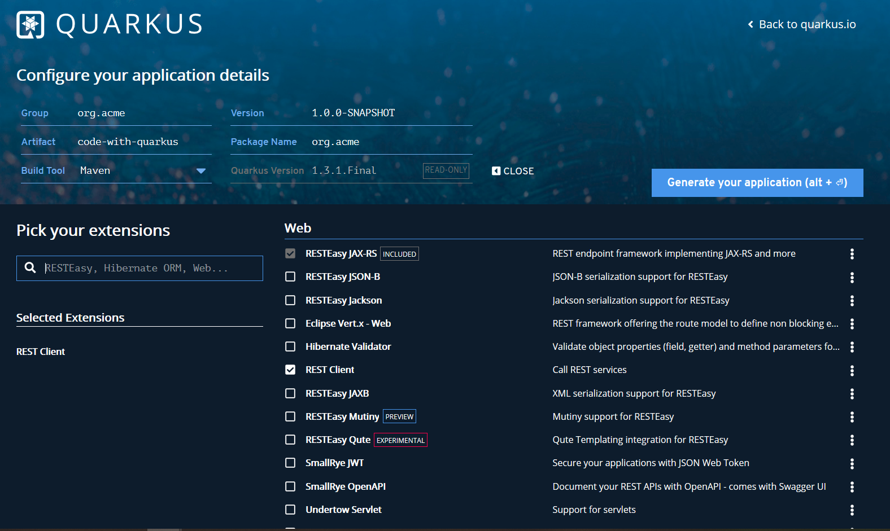

# Interacting with REST APIs in Quarkus 

In the last post, we [used Spring compatible APIs](https://medium.com/swlh/building-a-spring-application-with-quarkus-8c08b2a9cd8c) to rebuild [our original REST APIs](https://medium.com/@hantsy/kickstart-your-first-quarkus-application-cde54f469973) in a Quarkus application.  In this post, we will interact with the REST APIs in the client side.

There a few HTTP Client libraries used to communicate with REST APIs, such as [Apache HTTPClient](http://hc.apache.org/), [OkHttp](https://square.github.io/okhttp/), etc. And Spring has specific RestTemplate, WebClient API can be used to interact with REST APIs.

Quarkus has built-in support of the latest [Microprofile](https://www.microprofile.io), which includes a Rest Client spec for this purpose, the Quarkus **rest-client** supports both MP RestClient and JAX-RS Client API.

First of all, let's have a look at how to use MP RestClient to consume REST APIs.

Generate a simple Quarkus  application using [Quarkus Coding](https://code.quarkus.io/), remember adding **Rest Client** into dependencies.



Create a simple **interface**  `PostResourceClient`.

```java
@Path("/posts")
@RegisterRestClient
public interface PostResourceClient {

    @Path("count")
    @GET
    @Produces(MediaType.APPLICATION_JSON)
    CompletionStage<Long> countAllPosts(@QueryParam("q") String q);

    @GET
    @Produces(MediaType.APPLICATION_JSON)
    CompletionStage<List<Post>> getAllPosts(
            @QueryParam("q") String q,
            @QueryParam("offset") @DefaultValue("0") int offset,
            @QueryParam("limit") @DefaultValue("10") int limit
    );
}
```

The class and method signature is similar with [`PostResource`](https://github.com/hantsy/quarkus-sample/blob/master/post-service/src/main/java/com/example/PostResource.java) we have created in the former posts.  

* We declare an interface instead of a class.
* The interface is annotated with the `@RegisterRestClient` annotation.
* The method can return entity type directly  or a  Jaxrs's `Response` or Java 8's `CompletionStage` wrapper.

You can configure the `baseUri`  in the *application.properties*, or set `baseUri` attribute the `@RegisterRestClient` annotation.

Here is an example of the configuration in the *application.properties*.

```properties
com.example.PostResourceClient/mp-rest/url=http://localhost:8080
com.example.PostResourceClient/mp-rest/scope=javax.inject.Singleton
```

By default it uses the full qualified name of the Rest Client class as prefix of the config key. To change this, just set `configKey` attribute in  the `@RegisterRestClient` annotation.

To use the `PostResourceClient` in your CDI bean, just inject it by `@Inject` with a CDI qualifier `@RestClient`.

```java
@Path("/api")
@RequestScoped
public class PostController {
    @Inject
    @RestClient
    PostResourceClient client;

    @GET
    @Produces(MediaType.APPLICATION_JSON)
    public CompletionStage<PostPage> getAllPosts(
            @QueryParam("q") String q,
            @QueryParam("offset") @DefaultValue("0") int offset,
            @QueryParam("limit") @DefaultValue("10") int limit
    ) {
        return this.client.getAllPosts(q, offset, limit)
                .thenCombine(
                        this.client.countAllPosts(q),
                        (data, count) -> PostPage.of(data, count)
                );
    }

}
```

The above `getAllPosts` method is trying to combine the data and count into a new `PostPage` instance.

To test if the client is working as expected. Firstly you should start [the server side application](https://github.com/hantsy/quarkus-sample/blob/master/post-service) to serve the REST APIs. Run it by `mvn quarkus:dev` command. 

Then run the client application we are building by `mvn quarkus:dev` again.

```bash
$ curl http://localhost:8081/api/
{"content":[{"content":"My second post of Quarkus","createdAt":"2020-04-02T17:02:06.453988","id":"768a980f-b617-40c1-ba07-60759045d6b7","title":"Hello Again, Quarkus"},{"content":"My first post of Quarkus","createdAt":"2020-04-02T17:02:06.452993","id":"675bf657-fce4-4724-96c3-a2e2bf38ad58","title":"Hello Quarkus"}],"count":2}
```

In our [`PostResource`](https://github.com/hantsy/quarkus-sample/blob/master/post-service/src/main/java/com/example/PostResource.java) , to access a none existing post resource, it will return a 404 HTTP status.   Add the following method signature in the `PostResouceClient`.

```java
public interface PostResourceClient {
    ...
    @GET
    @Path("{id}")
    @Produces(MediaType.APPLICATION_JSON)
    CompletionStage<Post> getPostById(@PathParam("id") String id);
}
```

And create  a new method in the `PostController` to invoke the above APIs.

```java
public class PostController {
    ...
    @GET
    @Path("{id}")
    @Produces(MediaType.APPLICATION_JSON)
    public CompletionStage<Post> getPost(@PathParam("id") String id ){
        return this.client.getPostById(id);
    }
}    
```

When accessing a none existing post in the client application, it also return a  404 HTTP status. 

If you do not want MP Rest Client to convert it automatically, you can use `ResponseExceptionMapper` to convert the failure status into  a custom exception, and that leave room for you to handle it as you expected.

```java
public class PostResponseExceptionMapper implements ResponseExceptionMapper<RuntimeException> {
    @Override
    public RuntimeException toThrowable(Response response) {
        if(response.getStatus()==404) {
            return  new PostNotFoundException("post not found, original cause:" + response.readEntity(String.class));
        }

        return null;
    }
}
```

And register it on the `PostResourceClient` class with a `@RegisterProvider` annotation.

```java
@RegisterProvider(PostResponseExceptionMapper.class)
public interface PostResourceClient {}
```

Now, trying to accessing a none existing post resource, it will throw an `PostNotFoundException` in the background.

As an example, you can handle this exception with a custom `ExceptionMapper` in our client application. Check the [`PostNotFoundExceptionMapper`](https://github.com/hantsy/quarkus-sample/blob/master/restclient/src/main/java/com/example/PostNotFoundExceptionMapper.java) yourself.

Besides the declarative approach provided in MP Rest Client, JAX-RS 2.0 provides a Client APIs to shake hands with the REST APIs in a pragmatic way.

Let's have a look at  the JAX-RS version of `PostResourceClient`.

```java
@ApplicationScoped
public class PostResourceClient {
    private ExecutorService executorService = Executors.newCachedThreadPool();
    private Client client;
    private String baseUrl ;//= "http://localhost:8080";

    @Inject
    public PostResourceClient(PostServiceProperties properties) {
        baseUrl = properties.getBaseUrl();
        client = ClientBuilder.newBuilder()
                .executorService(executorService)
                .build();
    }

    CompletionStage<Long> countAllPosts(String q) {
        return client.target(baseUrl + "/posts/count")
                .queryParam("q", q)
                .request()
                .rx()
                .get(Long.class);
    }

    CompletionStage<List<Post>> getAllPosts(
            String q,
            int offset,
            int limit
    ) {
        return client.target(baseUrl + "/posts")
                .queryParam("q", q)
                .queryParam("offset", offset)
                .queryParam("limit", limit)
                .request()
                .rx()
                .get(new GenericType<List<Post>>() {});
    }

}
```

It uses the JAX-RS's  `ClientBuilder` to build a `Client` firstly, then use it to call REST APIs.

The `PostServiceProperties` is a MP config class to read external configuration from the *application.properties* file.

```java
@ConfigProperties(prefix = "post-service")
public class PostServiceProperties {
    private String baseUrl;

    public String getBaseUrl() {
        return baseUrl;
    }

    public void setBaseUrl(String baseUrl) {
        this.baseUrl = baseUrl;
    }
}
```

And the content of the *application.properties* file.

```properties
post-service.base-url=http://localhost:8080
```

But if you are using the JAX-RS client API, you should handle exceptions manually.

If you are using Java 11, it is luckily to use the brand new HttpClient APIs which is finalized to public since Java 11. 

The following is a new version using Java 11 HttpClient.

```java
@ApplicationScoped
public class PostResourceClient {

    private final ExecutorService executorService = Executors.newFixedThreadPool(5);

    private final HttpClient httpClient = HttpClient.newBuilder()
            .executor(executorService)
            .version(HttpClient.Version.HTTP_2)
            .build();


    public PostResourceClient() {
    }

    CompletionStage<Long> countAllPosts(String q) {
       return  this.httpClient
                .sendAsync(
                        HttpRequest.newBuilder()
                                .GET()
                                .uri(URI.create("http://localhost:8080/posts/count?q=" + q))
                                .header("Accept", "application/json")
                                .build()
                        ,
                        HttpResponse.BodyHandlers.ofString()
                )
                .thenApply(HttpResponse::body)
                .thenApply(Long::parseLong)
                .toCompletableFuture();

    }

    CompletionStage<List<Post>> getAllPosts(
            String q,
            int offset,
            int limit
    ) {
        return  this.httpClient
                .sendAsync(
                        HttpRequest.newBuilder()
                                .GET()
                                .uri(URI.create("http://localhost:8080/posts?q=" + q + "&offset=" + offset + "&limit=" + limit))
                                .header("Accept", "application/json")
                                .build()
                        ,
                        HttpResponse.BodyHandlers.ofString()
                )
                .thenApply(HttpResponse::body)
                .thenApply(stringHttpResponse -> JsonbBuilder.newBuilder().build().fromJson(stringHttpResponse, new TypeLiteral<List<Post>>() {}.getType()))
                .thenApply(data ->(List<Post>)data)
                .toCompletableFuture();
    }

}

```

In the `getAllPosts` method , it uses JSON-B to convert the raw HTTP messages from String to a `List<Post>`.

 Get the [source codes](https://github.com/hantsy/quarkus-sample) from my Github.

